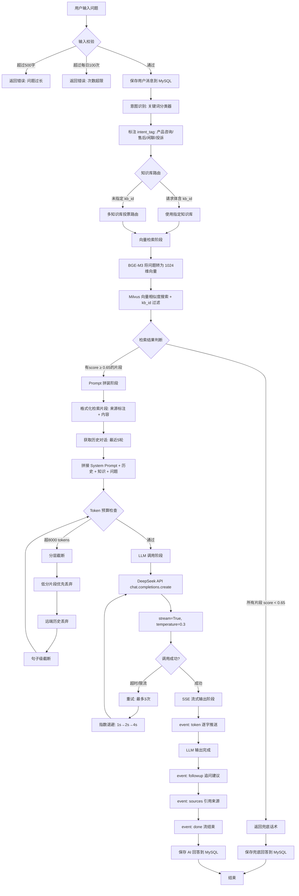

# AI 架构设计

> AI 智能客服系统 v1.0 | RAG 流程图 + Prompt 模板 + 向量检索策略

## 1. RAG 完整流程图



## 2. Prompt 模板设计

### 2.1 System Prompt（完整版）

```
## 角色
你是智能客服助手，专门为用户解答产品相关问题。

## 核心规则（必须遵守）
1. 你只能根据下方【知识库内容】回答问题
2. 如果知识库中没有相关信息，必须回答：
   "抱歉，我目前的知识库中暂未收录该信息"
3. 每条回答末尾必须标注引用来源：📚 参考：[文档名]

## 回答风格
- 简洁专业，先给出核心结论再展开说明
- 分点说明时使用有序列表
- 涉及流程时先概括再分步

## 知识库内容
{retrieved_chunks_formatted}

## 当前日期
{current_date}
```

### 2.2 Prompt 设计思路

| 设计点 | 具体做法 | 目的 |
|--------|----------|------|
| **角色定义** | 不指定具体公司名，只定义"智能客服助手" | 避免 LLM 编造公司相关信息 |
| **规则约束** | 三条硬规则，不可违反 | 从 Prompt 层面抑制幻觉 |
| **禁止编造** | 明确指令"不知道就说不知道" | 比"尽量别编"更强硬 |
| **来源标注** | 格式固定为 📚 参考：[文档名] | 使回答可追溯 |
| **当前日期** | 注入真实日期 `2026年06月23日` | 处理"7天内退换货"等时效性问题 |
| **temperature=0.3** | 低温度参数 | 确保回答一致性和准确性 |

### 2.3 检索片段格式化

```python
def format_retrieved_chunks(chunks: List[Dict]) -> str:
    """将检索结果格式化为 LLM 可读的文本"""
    formatted = []
    for i, chunk in enumerate(chunks, 1):
        formatted.append(
            f"[来源 {i}: {chunk['source']} (相关度: {chunk['score']})]\n"
            f"{chunk['text']}"
        )
    return "\n\n---\n\n".join(formatted)
```

格式化后效果：
```
[来源 1: 退换货政策.txt (相关度: 0.92)]
自签收之日起 7 天内，商品未使用且包装完好，可申请无理由退货。

---

[来源 2: 常见问题FAQ.md (相关度: 0.78)]
在管理后台的知识库页面，点击上传文档...
```

### 2.4 多轮对话上下文处理

```python
def build_messages(query, retrieved_chunks, history_messages, max_history_rounds=5):
    messages = [{"role": "system", "content": system_prompt}]

    # 只保留最近 N 轮（一轮 = user + assistant 两条）
    if history_messages:
        recent = history_messages[-(max_history_rounds * 2):]
        messages.extend(recent)

    # 当前问题
    messages.append({"role": "user", "content": query})
    return messages
```

## 3. 向量检索策略

### 3.1 检索参数

| 参数 | 默认值 | 说明 |
|------|--------|------|
| Top-K | 5 | 返回相似度最高的 5 个片段 |
| 相似度阈值 | 0.65 | 低于此值的片段丢弃 |
| 相似度度量 | COSINE | 余弦相似度（BGE-M3 推荐） |
| Embedding 维度 | 1024 | BGE-M3 输出维度 |

### 3.2 Top-K=5 的选择理由

- **太小（如 2）**：可能遗漏相关知识，导致回答不完整
- **太大（如 20）**：可能混入噪声，增加 Token 消耗，稀释 LLM 注意力
- **5 条**：经验值，在信息覆盖度和精准度之间平衡。通过相似度阈值（0.65）二次过滤后，实际有效片段通常为 3-5 条

### 3.3 相似度阈值 0.65 的选择理由

- BGE-M3 的 COSINE 相似度范围是 [-1, 1]（归一化后为 [0, 1]）
- 0.65：通过实际测试确定的经验阈值
  - 高于 0.65：通常为真实相关内容
  - 0.4-0.65：边缘相关（可能有主题词重叠但语义不匹配）
  - 低于 0.4：基本不相关
- 阈值可配置（`.env` 中 `SIMILARITY_THRESHOLD`），不同业务场景可调整

### 3.4 BGE-M3 Embedding 使用说明

```python
from sentence_transformers import SentenceTransformer

model = SentenceTransformer("BAAI/bge-m3", device="cpu")

# 对文档片段（不需要前缀）
doc_embeddings = model.encode(documents, normalize_embeddings=True)

# 对查询（BGE 官方推荐：短查询不推荐加前缀，长查询可加）
# 本项目查询 ≤500 字，视为短查询，不加前缀
query_embedding = model.encode(query, normalize_embeddings=True)
```

> **注意**：早期 BGE 模型推荐查询加 `"Represent this sentence for searching relevant passages:"` 前缀，BGE-M3 对此不敏感。本项目统一不加前缀，保持简洁。

## 4. 文档分块策略

### 4.1 参数

| 参数 | 值 | 说明 |
|------|-----|------|
| chunk_size | 500 字符 | 每个 chunk 的目标大小 |
| chunk_overlap | 50 字符 | 相邻 chunk 重叠部分 |

### 4.2 分块流程

```
1. 按双换行 (\n\n) 分割段落
2. 每个段落按单换行 (\n) 分割为句子
3. 合并短句子直到接近 chunk_size
4. 超过 chunk_size 的长段落按滑动窗口切分
5. 每个 chunk 附带 metadata: {source, chunk_index, char_count}
```

### 4.3 选择 500 字符的理由

- BGE-M3 的推荐输入长度为 512 tokens
- 中文字符与 token 比例约 1:1.5，500 字符 ≈ 750 tokens
- 略超过推荐值但实际效果好——保留了更完整的语义单元

## 5. LLM 调用配置

```python
response = await client.chat.completions.create(
    model="deepseek-chat",
    messages=messages,
    stream=True,           # 流式输出
    temperature=0.3,       # 低温度：减少随机性，提高准确性
    max_tokens=2048,       # 回答长度上限
    timeout=30,            # 超时秒数
)
```

**参数说明**：
- `stream=True`：启用 SSE 流式输出
- `temperature=0.3`：客服场景需要确定性回答，低温度减少随机性
- `max_tokens=2048`：客服回答通常 100-500 tokens，2048 留足余量
- `timeout=30`：DeepSeek 通常 1-3s 出首 token，30s 充足

## 6. 关键设计决策回顾

| 决策 | 选项 A | 选项 B | 最终选择 | 理由 |
|------|--------|--------|----------|------|
| 框架 | LangChain | 手动实现 | **手动实现** | 理解原理，精细控制 |
| LLM | OpenAI | DeepSeek | **DeepSeek** | 用户提供 Key |
| Embedding | 云端 API | 本地 BGE-M3 | **本地 BGE-M3** | 中文 SOTA，零成本 |
| 向量库 | Chroma | Milvus | **Milvus** | 用户指定 |
| 流式协议 | SSE | WebSocket | **SSE** | 单向数据流，更简单 |
| PDF 解析 | 手动写 | LlamaIndex | **LlamaIndex Reader** | 复用成熟方案 |

## 7. 意图识别

### 7.1 关键词分类器

意图识别采用轻量级关键词匹配方案，无需额外模型调用，在向量检索之前完成分类。

```python
INTENT_RULES = {
    "售后问题": ["退", "换", "退款", "退货", "投诉", "质量问题", "坏了", "修"],
    "产品咨询": ["多少钱", "价格", "功能", "怎么用", "版本", "支持", "配置"],
    "闲聊":     ["你好", "谢谢", "再见", "你是谁", "天气"],
    "投诉":     ["投诉", "不满", "差评", "客服态度", "维权"],
}
```

**分类流程**：
1. 接收用户问题后，按规则表顺序遍历
2. 命中任一关键词即返回对应标签
3. 未命中则默认归为"产品咨询"
4. 意图标签写入 `messages.intent_tag`，供后续统计分析

### 7.2 设计思路

| 设计点 | 说明 |
|--------|------|
| 无需 LLM | 轻量关键词匹配，零延迟，零成本 |
| 规则可扩展 | INTENT_RULES 字典可按业务需求增删 |
| 优先级顺序 | 按规则表顺序匹配，首次命中即返回 |
| 默认兜底 | 未命中归入"产品咨询"，避免空标签 |

## 8. 多知识库自动路由

### 8.1 路由策略

当用户未指定 `kb_id` 时，系统使用**投票路由**策略自动选择最相关的知识库：

```
1. 意图识别 → 获取 intent_tag
2. 按 kb_id 分组，对每个知识库独立检索
3. 对每个 kb 的 top-K 结果进行投票：
   - 片段相似度 ≥ 0.65 的记 1 票
   - 片段相似度 ≥ 0.80 的记 2 票（高置信加权）
4. 选择票数最高的知识库
5. 如多个知识库票数相同，选择片段平均分最高的
6. 如所有知识库均无有效结果（票数 0），返回兜底话术
```

### 8.2 投票算法伪代码

```python
def vote_kb(query_embedding, kb_ids, top_k=3):
    results = {}  # kb_id -> vote_count

    for kb_id in kb_ids:
        chunks = vector_store.search(
            query_embedding,
            top_k=top_k,
            threshold=0.65,
            filter={"kb_id": kb_id}
        )
        votes = sum(
            2 if c["score"] >= 0.80 else 1
            for c in chunks if c["score"] >= 0.65
        )
        results[kb_id] = votes

    # 选票数最高的知识库；平票时比平均分
    best_kb = max(results, key=lambda k: (
        results[k],
        avg_score_of(k) if results[k] > 0 else 0
    ))

    if results[best_kb] == 0:
        return None  # 所有 KB 无有效结果 → 兜底

    return best_kb
```

### 8.3 路由决策表

| 条件 | 行为 |
|------|------|
| 请求指定 `kb_id` | 直接使用该知识库检索 |
| 未指定 + 单知识库 | 直接检索该知识库 |
| 未指定 + 多知识库 | 投票路由选最优知识库 |
| 路由结果为空 | 返回兜底话术 |

## 9. AI Agent 任务拆解

### 9.1 功能概述

AI Agent 模块将自然语言需求拆解为微服务层面的改动分析任务列表。输入一段用户需求描述，输出结构化的排查/改动任务清单。

### 9.2 处理流程

```
用户需求文本
  → System Prompt: "你是软件架构分析专家..."
  → LLM 分析需求，关联微服务拓扑
  → 结构化输出：任务列表 (title, description, service, priority)
  → 返回 JSON
```

### 9.3 Prompt 设计

```
## 角色
你是软件架构分析专家，擅长将用户需求拆解为微服务层面的改动分析任务。

## 输入
一段用户反馈的需求或问题。

## 输出格式
必须返回严格的 JSON 数组，每个元素包含：
- title: 任务标题（简短）
- description: 任务详细描述（1-2 句）
- service: 涉及的微服务名称
- priority: high / medium / low

## 约束
- 只返回 JSON，不包含任何解释文字
- 任务数量 2-5 个
- 优先关注 root cause 排查，其次才是修复方案
```

### 9.4 LLM 调用参数

```python
response = await client.chat.completions.create(
    model="deepseek-chat",
    messages=messages,
    temperature=0.3,
    max_tokens=1024,
    response_format={"type": "json_object"},  # 强制 JSON 输出
)
```

### 9.5 示例

**输入**：用户下单后未收到确认短信，怀疑系统未发送通知

**输出**：

```json
{
  "tasks": [
    {
      "id": 1,
      "title": "排查短信发送服务",
      "description": "检查短信网关日志，确认请求是否到达、是否有错误响应",
      "service": "sms-service",
      "priority": "high"
    },
    {
      "id": 2,
      "title": "核查订单状态",
      "description": "查询订单表确认订单是否创建成功、状态是否为已支付",
      "service": "order-service",
      "priority": "high"
    },
    {
      "id": 3,
      "title": "检查通知规则",
      "description": "确认用户通知偏好设置，排查是否有规则过滤导致未发送",
      "service": "notification-service",
      "priority": "medium"
    }
  ]
}
```

### 9.6 边界与限制

| 限制 | 说明 |
|------|------|
| 单次输入 ≤ 1000 字 | 超长需求建议分段拆解 |
| 任务数 2-5 个 | 超出范围由 LLM 自行裁剪 |
| 不执行实际代码 | Agent 仅做分析规划，不修改代码或配置 |
| 微服务列表来自 LLM 推断 | 未对接实际服务注册中心 |
