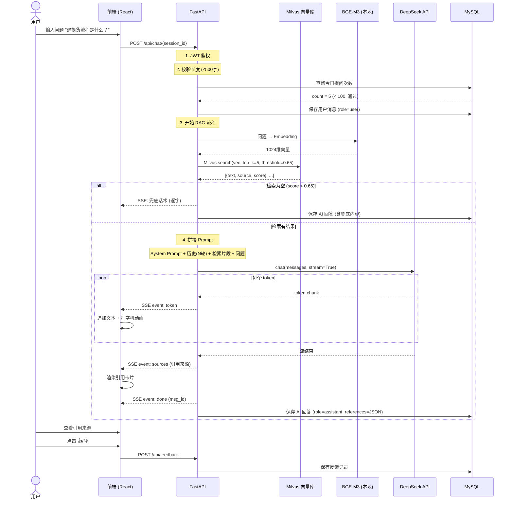
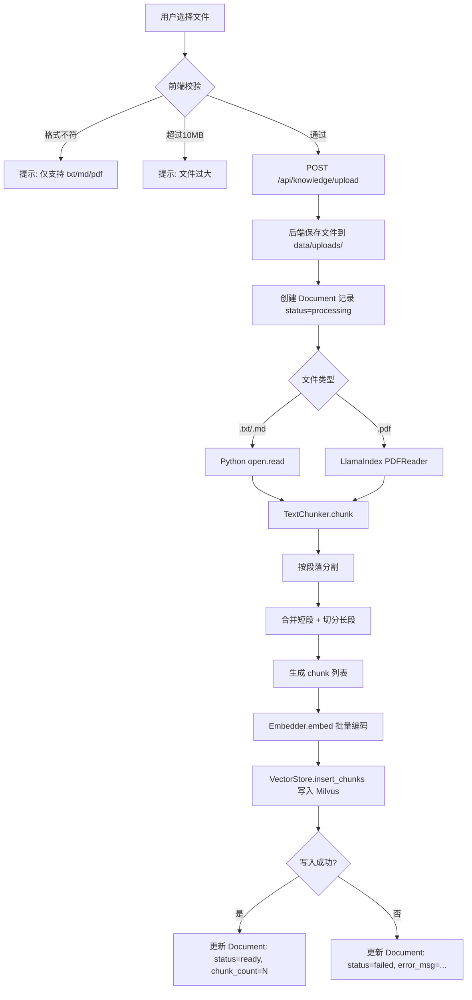
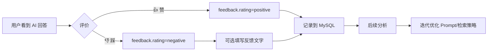
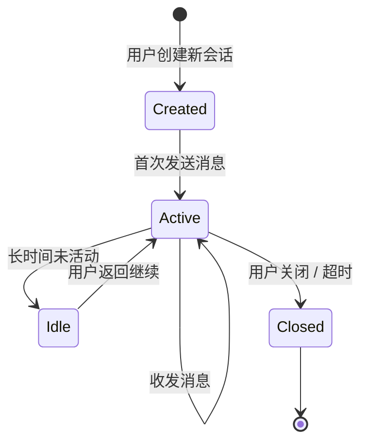
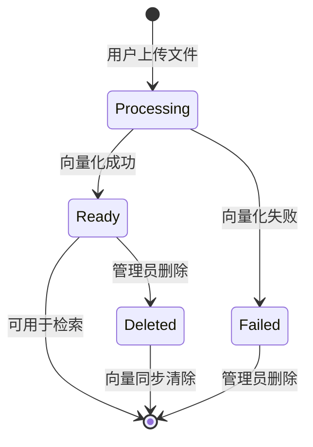
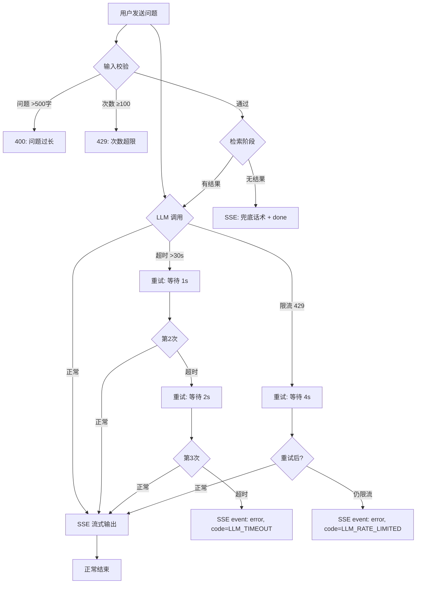

# 业务流程说明

> AI 智能客服系统 v1.0 | 核心业务流程

## 1. 问答完整链路

### 1.1 时序图



### 1.2 关键路径耗时分析

```
用户发送问题
  │
  ├─ [50ms]   JWT 验证
  ├─ [20ms]   输入校验
  ├─ [10ms]   查询每日次数 + 保存用户消息
  ├─ [200ms]  BGE-M3 Embedding (CPU, 单句)
  ├─ [30ms]   Milvus 向量检索
  ├─ [10ms]   Prompt 拼接
  ├─ [~2s]    DeepSeek 首 token 延迟
  ├─ [~5s]    DeepSeek 流式输出 (500 token 回答)
  ├─ [10ms]   保存 AI 回答到 MySQL
  │
  ▼
用户看到完整回答：总计约 7-8 秒（主要耗时在 LLM 推理）
流式体验：用户 2 秒内看到首字，持续输出约 5 秒
```

## 2. 文档入库流程



## 3. 用户反馈闭环



## 4. 会话生命周期



## 5. 文档处理状态机



## 6. 异常处理流程


