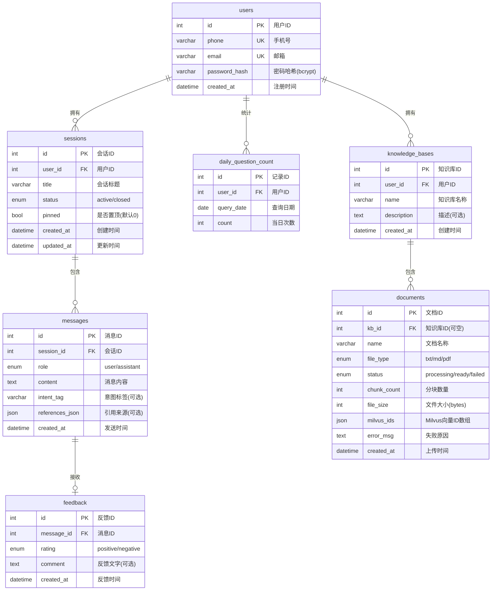

# 数据库设计

> AI 智能客服系统 v1.0 | ER 图 + 表结构说明

## 1. ER 图



## 2. 表结构详细说明

### 2.1 users — 用户表

| 字段 | 类型 | 约束 | 说明 |
|------|------|------|------|
| id | INT | PK, AUTO_INCREMENT | 用户唯一标识 |
| phone | VARCHAR(20) | UNIQUE, NULLABLE | 手机号。与 email 至少一个非空 |
| email | VARCHAR(255) | UNIQUE, NULLABLE | 邮箱。与 phone 至少一个非空 |
| password_hash | VARCHAR(255) | NOT NULL | bcrypt 哈希后的密码，不可逆 |
| created_at | DATETIME | DEFAULT CURRENT_TIMESTAMP | 注册时间 |

**设计要点**：
- phone 和 email 均设为 UNIQUE 但允许 NULL（可选填）
- 密码使用 bcrypt 哈希，不存明文
- 应用层校验 phone/email 至少填一个

### 2.2 sessions — 会话表

| 字段 | 类型 | 约束 | 说明 |
|------|------|------|------|
| id | INT | PK, AUTO_INCREMENT | 会话唯一标识 |
| user_id | INT | FK → users.id, ON DELETE CASCADE | 所属用户 |
| title | VARCHAR(100) | DEFAULT '新会话' | 会话标题（取首条消息前 30 字） |
| status | ENUM('active','closed') | DEFAULT 'active' | 会话状态 |
| created_at | DATETIME | DEFAULT CURRENT_TIMESTAMP | 创建时间 |
| updated_at | DATETIME | ON UPDATE CURRENT_TIMESTAMP | 最后活跃时间 |

**设计要点**：
- `ON DELETE CASCADE`：删除用户时同步删除其所有会话
- `updated_at` 自动更新：每次收发消息时触发
- 会话列表按 `updated_at DESC` 排序

### 2.3 messages — 消息表

| 字段 | 类型 | 约束 | 说明 |
|------|------|------|------|
| id | INT | PK, AUTO_INCREMENT | 消息唯一标识 |
| session_id | INT | FK → sessions.id, ON DELETE CASCADE | 所属会话 |
| role | ENUM('user','assistant') | NOT NULL | 发言角色 |
| content | TEXT | NOT NULL | 消息正文（用户问题或 AI 回答） |
| intent_tag | VARCHAR(50) | NULLABLE | 意图分类标签（加分项，可为空） |
| references_json | JSON | NULLABLE | 引用来源 JSON 数组 |
| created_at | DATETIME | DEFAULT CURRENT_TIMESTAMP | 消息时间 |

**references_json 结构**：

```json
[
  {
    "doc_name": "退换货政策.txt",
    "snippet": "自签收之日起 7 天内，商品未使用且包装完好，可申请无理由退货。",
    "score": 0.92
  },
  {
    "doc_name": "常见问题FAQ.md",
    "snippet": "在管理后台的知识库页面，点击上传文档...",
    "score": 0.78
  }
]
```

**设计要点**：
- `references_json` 只在 role='assistant' 时有值，role='user' 时为 NULL
- 使用 MySQL JSON 类型而非 TEXT，支持后续 JSON 路径查询
- 消息按 `created_at ASC` 排序以保持对话时序

### 2.4 feedback — 反馈表

| 字段 | 类型 | 约束 | 说明 |
|------|------|------|------|
| id | INT | PK, AUTO_INCREMENT | 反馈唯一标识 |
| message_id | INT | FK → messages.id, ON DELETE CASCADE | 被评价的消息 |
| rating | ENUM('positive','negative') | NOT NULL | 赞 / 踩 |
| comment | TEXT | NULLABLE | 可选文字反馈（踩时填写） |
| created_at | DATETIME | DEFAULT CURRENT_TIMESTAMP | 反馈时间 |

**设计要点**：
- 每条消息最多一条反馈（应用层去重，不设 UNIQUE 约束）
- `ON DELETE CASCADE`：消息删除时反馈同步删除

### 2.5 knowledge_bases — 知识库表

| 字段 | 类型 | 约束 | 说明 |
|------|------|------|------|
| id | INT | PK, AUTO_INCREMENT | 知识库唯一标识 |
| user_id | INT | FK → users.id, ON DELETE CASCADE | 所属用户 |
| name | VARCHAR(100) | NOT NULL | 知识库名称 |
| description | TEXT | NULLABLE | 知识库描述 |
| created_at | DATETIME | DEFAULT CURRENT_TIMESTAMP | 创建时间 |

**设计要点**：
- 每个用户可以创建多个知识库
- `ON DELETE CASCADE`：删除用户时同步删除其所有知识库
- 删除知识库时（ON DELETE SET NULL），关联文档的 `kb_id` 置空，文档及向量数据保留

### 2.6 documents — 知识库文档表

| 字段 | 类型 | 约束 | 说明 |
|------|------|------|------|
| id | INT | PK, AUTO_INCREMENT | 文档唯一标识 |
| kb_id | INT | FK → knowledge_bases.id, ON DELETE SET NULL, NULLABLE | 所属知识库 |
| name | VARCHAR(255) | NOT NULL | 原始文件名 |
| file_type | ENUM('txt','md','pdf') | NOT NULL | 文件格式 |
| status | ENUM('processing','ready','failed') | DEFAULT 'processing' | 处理状态 |
| chunk_count | INT | DEFAULT 0 | 分块总数 |
| file_size | INT | DEFAULT 0 | 文件大小 (bytes) |
| milvus_ids | JSON | NULLABLE | Milvus 中对应的向量 ID 数组 |
| error_msg | TEXT | NULLABLE | 处理失败时的错误信息 |
| created_at | DATETIME | DEFAULT CURRENT_TIMESTAMP | 上传时间 |

**milvus_ids 结构**：

```json
[456789012345678901, 456789012345678902, 456789012345678903]
```

**设计要点**：
- `kb_id` 为 NULL 时表示文档属于默认知识库（全局检索池）
- `ON DELETE SET NULL`：删除知识库时保留文档，仅清空 kb_id 关联
- `milvus_ids` 是 Milvus 向量库的桥接字段。删除文档时，按此数组批量删除 Milvus 向量
- status 状态机：`processing → ready`（成功）/ `processing → failed`（失败）
- documents 表与 messages 表无 FK 关联——文档引用通过 `messages.references_json` 字段以非结构化方式记录

### 2.7 daily_question_count — 每日提问计数表

| 字段 | 类型 | 约束 | 说明 |
|------|------|------|------|
| id | INT | PK, AUTO_INCREMENT | 记录 ID |
| user_id | INT | FK → users.id, ON DELETE CASCADE | 用户 ID |
| query_date | DATE | NOT NULL | 统计日期 |
| count | INT | DEFAULT 0 | 当日提问次数 |

**唯一约束**：`UNIQUE KEY uk_user_date (user_id, query_date)`

**设计要点**：
- 使用 `INSERT ... ON DUPLICATE KEY UPDATE count = count + 1` 或 `SELECT → UPDATE/INSERT` 策略
- 每日零点自动归零（按日期分组，无需重置）
- 当前为 MySQL 方案；生产环境可迁移到 Redis（原子 INCR + TTL）

## 3. 索引策略

| 表 | 索引 | 类型 | 用途 |
|----|------|------|------|
| users | phone | UNIQUE | 手机号注册/登录查询 |
| users | email | UNIQUE | 邮箱注册/登录查询 |
| sessions | user_id | INDEX | 按用户查询会话列表 |
| messages | session_id | INDEX | 按会话查询消息 |
| feedback | message_id | INDEX | 按消息查询反馈 |
| knowledge_bases | user_id | INDEX | 按用户查询知识库列表 |
| documents | kb_id | INDEX | 按知识库查询文档列表 |
| daily_question_count | (user_id, query_date) | UNIQUE | 每日计数 upsert |

## 4. 数据量估算

| 表 | 预估行数 | 单行大小 | 总大小 |
|----|----------|----------|--------|
| users | 1000 | ~200B | 200KB |
| sessions | 5000 | ~150B | 750KB |
| messages | 50000 | ~2KB | 100MB |
| feedback | 10000 | ~100B | 1MB |
| knowledge_bases | 500 | ~200B | 100KB |
| documents | 100 | ~350B | 35KB |
| daily_question_count | 365000 | ~50B | 18MB |

> 预估基于：1000 用户，每用户平均 0.5 个知识库，每用户 5 会话，每会话 10 轮对话。开发阶段数据量极小，无需分表分库。

## 5. 迁移说明

- 使用 `backend/db/init.sql` 初始化数据库结构
- 开发阶段使用 `Base.metadata.create_all()` 自动建表（`init_knowledge.py` 中）
- 生产环境建议使用 Alembic 做 schema 版本管理
